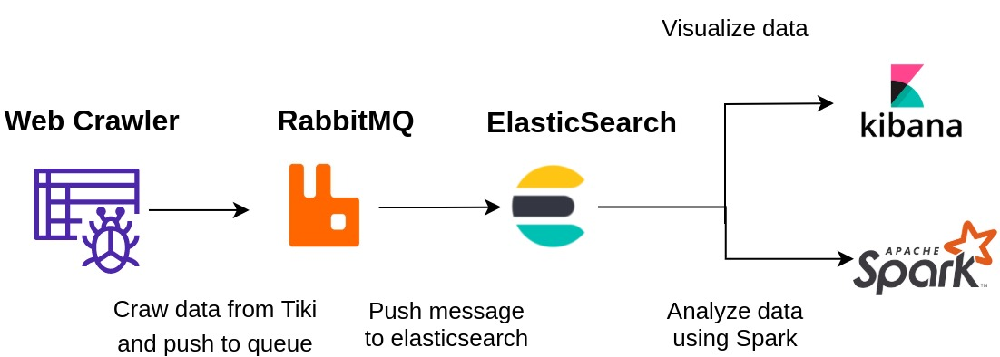

# BigData
This repository purposes to host spark cluster, elasticsearch, rabbitmq, kibana

**Data Pipeline**


**Build cluster**
```bash
cd cluster
docker-compose up -d
```
**Build Docker image**
```bash
docker build -t bigdata -f docker/Dockerfile .
```

**Local testing**
```python
python3 -m main
```